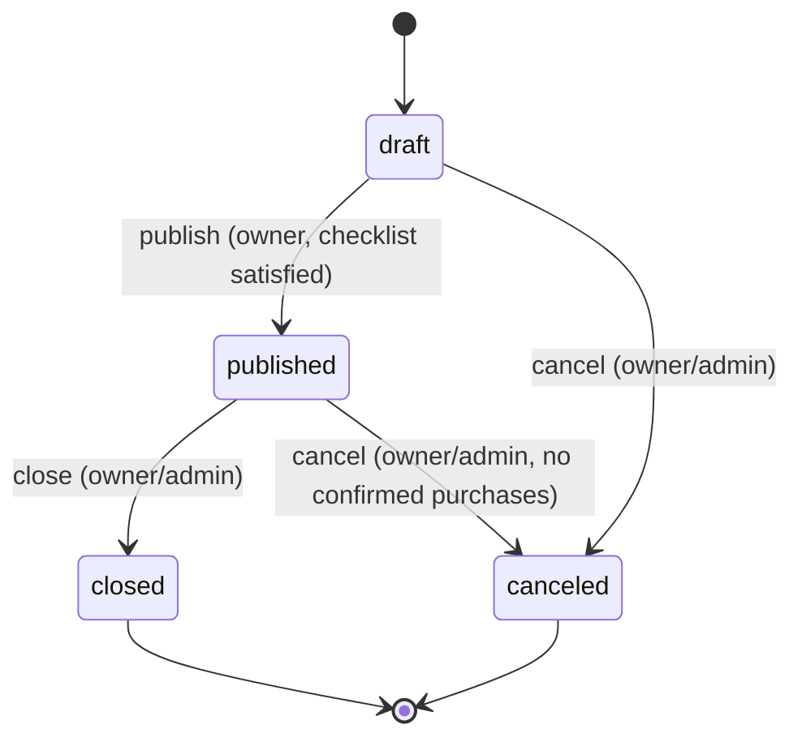

# Material Lifecycle State Machine

Every material has an explicit `status` field driving what a creator, buyer,
and the marketplace can do with it. All status changes go through the
lifecycle domain service at
[src/lib/materials/materialLifecycle.js](../src/lib/materials/materialLifecycle.js) —
generic material updates (`PUT /api/materials`) explicitly reject a `status`
field, so there is exactly one code path that can move a material between
states.

## States

| Status | Meaning |
|--------|---------|
| `draft` | Created, editable, not visible in the marketplace. Default status for new materials. |
| `published` | Live and purchasable. |
| `closed` | No longer accepting new purchases; existing entitlements are unaffected. Terminal. |
| `canceled` | Withdrawn before ever generating a purchase. Terminal. |

## Diagram

## Transition table

| From | To | Route | Preconditions | Caller |
|------|----|-------|---------------|--------|
| `draft` | `published` | `POST /api/materials/[id]/publish` | Publishing checklist required fields all present | Owner |
| `draft` | `canceled` | `POST /api/materials/[id]/cancel` | None | Owner or admin |
| `published` | `closed` | `POST /api/materials/[id]/close` | None | Owner or admin |
| `published` | `canceled` | `POST /api/materials/[id]/cancel` | No confirmed purchases exist (use `close` instead if there are) | Owner or admin |

Any other `(from, to)` pair is rejected with a typed `409` response
(`code: "invalid_transition"`). Requesting a transition to the material's
current status is idempotent — it returns `200` without mutating the
document or writing a history record.

## Concurrency

Every transition is applied with `findOneAndUpdate` guarded by the expected
current status in the Mongo filter (`{ _id, status: from }`). If two
requests race, only the request whose filter still matches wins; the other
receives `null` back from Mongo and the domain service reports it as a typed
`409` conflict (`code: "conflict"`) instead of silently double-applying.

## History

Every successful transition inserts one immutable document into
`material_status_history`: `{ materialId, actor, previousStatus, nextStatus,
reason, createdAt }`. Records are never updated or deleted.

## Migration

Materials created before this state machine existed did not carry an
explicit `status` field. Migration
[004-material-lifecycle.js](../src/lib/backend/migrations/004-material-lifecycle.js)
backfills it by inference (`publishedAt` set or `visibility: "public"` ->
`published`, otherwise `draft`) so every material's *effective* status is
unchanged — it only makes the existing implicit state explicit.

## Error codes

| `MaterialLifecycleError.code` | HTTP status | Meaning |
|--------------------------------|-------------|---------|
| `not_found` | 404 | Material does not exist |
| `forbidden` | 403 | Caller is neither the owner nor an admin |
| `invalid_transition` | 409 | The `(from, to)` pair is not in the transition graph |
| `checklist_incomplete` | 400 | Publishing checklist required fields are missing |
| `precondition_failed` | 409 | Blocked by the state of another resource (e.g. existing confirmed purchases) |
| `conflict` | 409 | Status changed concurrently between read and write |
